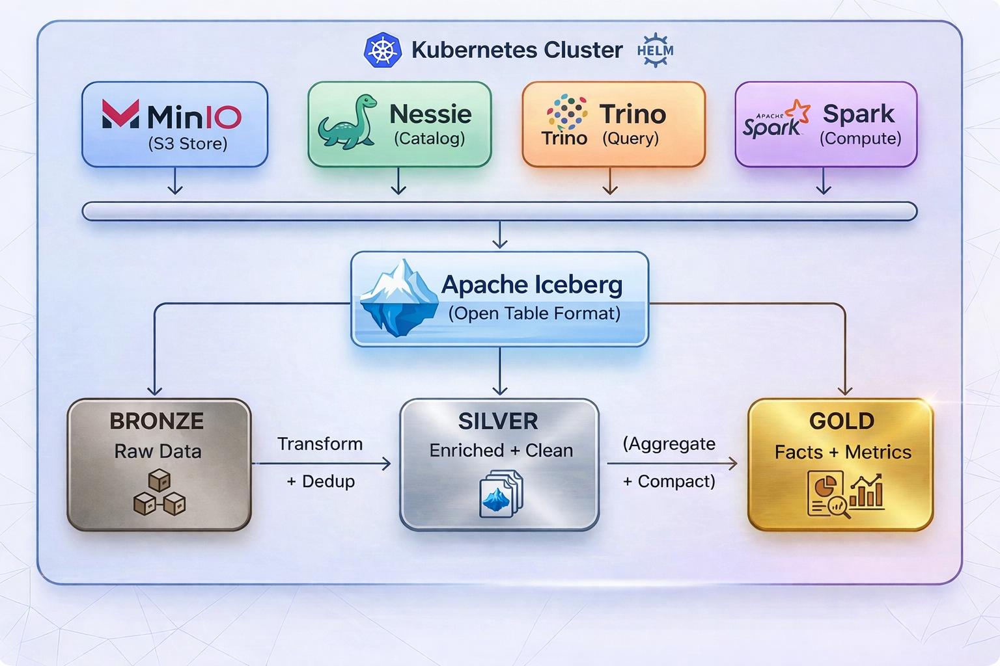

# Cascade Lakehouse

A production-grade **Data Lakehouse** implementation using the **Medallion Architecture** (Bronze → Silver → Gold) on Kubernetes, built with Apache Spark, Apache Iceberg, Project Nessie, MinIO, and Trino.

> 📖 **For a detailed walkthrough of every file, step-by-step setup, and troubleshooting, see the [User Manual (DOCS.md)](DOCS.md)**

## Architecture



## Tech Stack

| Component | Technology | Purpose |
|-----------|-----------|---------|
| **Storage** | MinIO (S3-compatible) | Object storage for Parquet data files |
| **Table Format** | Apache Iceberg | ACID transactions, schema evolution, time travel |
| **Catalog** | Project Nessie | Git-like branching for data versioning |
| **Compute** | Apache Spark 3.5 | Distributed data processing via Spark Structured Streaming |
| **Query Engine** | Trino | SQL analytics on Iceberg tables |
| **Orchestration** | Kubernetes + Spark Operator | Pod scheduling and lifecycle management |

## Project Structure

```
lakehouse-medallion-pipeline/
├── infrastructure/        # K8s deployments for MinIO, Nessie, Trino
├── spark-jobs/            # SparkApplication YAMLs (DDL, ingestion, transform, facts)
├── src/
│   ├── table_setup/       # Schema & table creation (CREATE TABLE IF NOT EXISTS)
│   ├── ingestion/         # Bronze layer: generate & ingest raw events + load dimensions
│   ├── transformation/    # Silver layer: MERGE INTO with dimension table JOINs
│   ├── facts/             # Gold layer: aggregation + file compaction
│   ├── data_enrichment/   # Product & user lookup services (dim table data sources)
│   └── spark_helpers/     # Spark session, product catalog
├── runners/               # Entry point scripts for each pipeline stage
├── Dockerfile             # Spark 3.5 + Python app image
└── requirements.txt       # Python dependencies
```

## Medallion Layers

### Bronze (Raw Ingestion)
- Generates synthetic e-commerce events: **page views** (10/sec) and **click events** (30/sec)
- Writes raw data to Iceberg tables with `bucket(3, event_id)` partitioning
- Deduplicates within each micro-batch using `row_number()` window function

### Silver (Enrichment & Dedup)
- Streaming `MERGE INTO` ensures cross-batch deduplication on `event_id`
- Enriches data via **dimension table JOINs** against `dim_products` and `dim_users` (replaces per-row Python UDFs for better performance)
- Aggregation tables provide pre-computed summaries for Gold layer

### Gold (Business Facts)
- Aggregates Silver data into `fact_product_metrics` with per-minute granularity
- Runs Iceberg `rewrite_data_files` for file compaction (target: 512MB files)
- Provides query-ready business metrics

## MERGE-Based Idempotency

The Silver layer implements **MERGE-based idempotency** to guarantee exactly-once semantics — even if a Spark job crashes and replays the same batch:

```sql
MERGE INTO silver.page_views AS target
USING (SELECT ... FROM batch) AS source
ON target.event_id = source.event_id
WHEN NOT MATCHED THEN INSERT *
-- ↑ Only inserts if event_id doesn't already exist in Silver
```

**Why this matters:**
- If a streaming job **crashes and retries** the same batch, the MERGE skips already-inserted rows → **no duplicates**
- If an event arrives in **multiple batches** (network retry, at-least-once delivery), it's inserted only once
- Running the same batch N times produces the **exact same result** as running it once — that's idempotency

**Production relevance:** In real-world pipelines with **Apache Kafka**, consumers use at-least-once delivery by default — the same event can be delivered multiple times. MERGE-based idempotency is the standard pattern to achieve **exactly-once semantics** at the storage layer, making it safe to replay data without worrying about duplicates.

## How Iceberg Writes Work

```
DataFrame.writeTo("nessie.bronze.page_views").append()
    │
    ├── 1. Spark writes Parquet data files to MinIO  (s3://warehouse/bronze/data/*.parquet)
    ├── 2. Iceberg creates a manifest file listing those Parquet files
    ├── 3. Iceberg creates a new snapshot pointing to the manifest
    ├── 4. Iceberg writes a NEW metadata file (v3.metadata.json) with the updated snapshot pointer
    └── 5. Nessie atomically swaps the catalog pointer to the new metadata file
    
    Old snapshots & metadata files are never modified → time travel + concurrent reads are safe
```

## Prerequisites

- Docker Desktop with Kubernetes enabled (8GB+ RAM recommended)
- `kubectl` CLI
- Spark Operator installed: `helm install spark-operator spark-operator/spark-operator`

## Quick Start

### 1. Deploy Infrastructure
```bash
kubectl apply -f infrastructure/
```

### 2. Create MinIO Bucket
```bash
kubectl exec -it <minio-pod> -- mkdir -p /data/warehouse
```

### 3. Build the Spark Image
```bash
docker build -t webclickstream-events .
```

### 4. Create Tables (DDL)
```bash
# Run one at a time
kubectl apply -f spark-jobs/ddl/bronze-ddl.yaml
# Wait for COMPLETED, then:
kubectl apply -f spark-jobs/ddl/silver-ddl.yaml
# Wait for COMPLETED, then:
kubectl apply -f spark-jobs/ddl/gold-ddl.yaml
```

### 5. Load Dimension Tables
```bash
# Load product catalog + user attributes into dim_products & dim_users
# Must run AFTER DDL and BEFORE Silver transforms
kubectl apply -f spark-jobs/ddl/load-dimensions.yaml
# Wait for COMPLETED
```

### 6. Run Pipeline (Wave-by-Wave)

```bash
# Wave 1: Bronze Ingestion
kubectl apply -f spark-jobs/bronze/bronze-ingest-pageviews.yaml
kubectl apply -f spark-jobs/bronze/bronze-ingest-clickevents.yaml

# Wave 2: Silver Transform (JOINs against dim tables for enrichment)
kubectl apply -f spark-jobs/silver/silver-transform-pageviews.yaml
kubectl apply -f spark-jobs/silver/silver-transform-clickevents.yaml

# Wave 3: Silver Aggregation
kubectl apply -f spark-jobs/silver/silver-aggregation-pageviews.yaml
kubectl apply -f spark-jobs/silver/silver-aggregation-clickevents.yaml

# Wave 4: Gold Facts
kubectl apply -f spark-jobs/gold/gold-fact-productmetrics-pageview.yaml
kubectl apply -f spark-jobs/gold/gold-fact-productmetrics-clickevents.yaml
```

### 7. Query with Trino
```bash
kubectl exec -it <trino-pod> -- trino

# Check data across layers
SELECT COUNT(*) FROM iceberg.bronze.page_views;
SELECT COUNT(*) FROM iceberg.silver.page_views;
SELECT COUNT(*) FROM iceberg.gold.fact_product_metrics;

# Business query: top products by views per minute
SELECT product_name, product_segment, minute_ts, counts
FROM iceberg.gold.fact_product_metrics
WHERE count_type = 'views'
ORDER BY counts DESC
LIMIT 10;
```

## Key Design Patterns

| Pattern | Where Used | Why |
|---------|-----------|-----|
| `MERGE INTO ... WHEN NOT MATCHED` | Silver Transform | Atomic upsert for cross-batch dedup |
| MERGE-based idempotency | Silver Transform | Exactly-once semantics — safe to replay batches (essential for Kafka) |
| Dimension table JOINs | Silver Transform | Enrich raw data with product/user attributes (replaces per-row Python UDFs) |
| `foreachBatch` + Spark Structured Streaming | All streaming jobs | Micro-batch processing with checkpoints |
| `bucket(3, event_id)` partitioning | Bronze & Silver | Efficient partition pruning on MERGE JOINs |
| `month(created_ts)` partitioning | Bronze & Silver | Time-based query pruning for analytical queries |
| `rewrite_data_files` | Gold Facts | File compaction to prevent small file problem |

## License

This project is licensed under the MIT License
